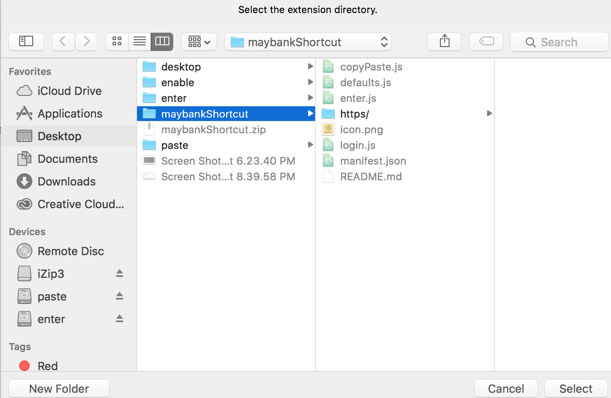

<h1>About</h1>

This extension enables users to press enter upon completing form , allows user to also paste username & password
  

<h1>Installation </h1>

(a)Go to extension , make sure "Developer Mode" is checked

(b)Select "Load unpacked extension"

   
  

Select the parent folder

